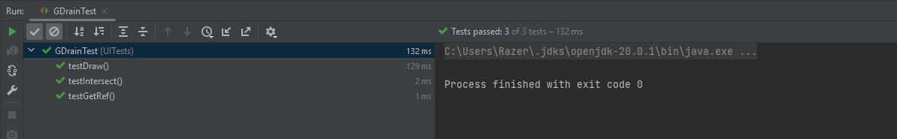
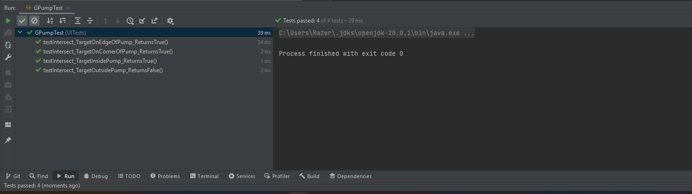
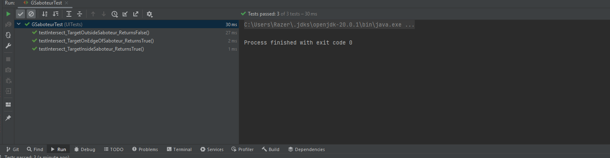
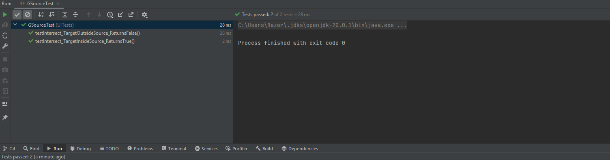
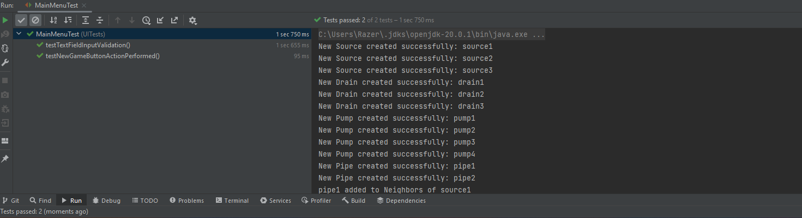

# UI teszek készítése

A feladatban a különböző Swinges UI komponensekhez készítettünk teszteseteket. Sajnos sokszori próbálkozás után sem tudtuk megfelelően konfigurálni az összes UI tesztet a CI-al, ezért ezek -a konzisztencia miatt- lokálisan elérhetők.

# GDrainTest
A Drain UI komponensét teszteljük, azon belül is a Drainek létrehozását, az Intersect, Draw és getRef függvényt. Az Intersect függvény tesztelés során észrevettem, hogy a függvény nem volt olvasható, azt javítottam. A tesztek eredménye:

# MechanicTest

A Mechanic UI elemeit teszteljük, itt is a setupot, az intersectet és a getRef függvényeket teszteltem, újfent változattam az Intersect metóduson az forráskódban, hogy pontosabb legyen a számítás

#  GPipeTest

A csöveknek az elhelyezését teszteljük. Létre kellett hoznom settereket, hogy tudjam állítani a tesztben a cső középpontjának koordinátáit

# GPumpTest

A pumpa Intersect függvényét teszteljük behatóbban. A 4 teszteseben azt vizsgáljuk, hogy egy target koordináta a pumpa belséjebe, kívül a pumpán, a pumpa szélén, vagy sarkán van-e.

# GSaboteurTest

Az előzőhöz nagyon hasonlóan: azt teszteljük, hogy egy adott koordináta a szabotőrön kívül, belül, illetve a szélén található-e.

# GSourceTest

Azt vizsgáljuk, hogy egy adott koordináta a forráson kívül, vagy belül található-e.

# MainMenuTest

Azt teszteljük, hogy a főmenüben található szövegmezők valóban jól megkapják a felhasználó által megadott értéket.

